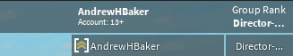

# RO-Create Leaderboard Functions Example

### How to do this:


### Here's how:
```lua
local robloxFunctions = require(2176004587)

robloxFunctions.newLeaderboard({
	{"Group Rank", "group", 2939937},
	{"Custom Column", "string", "Penis!"}
})

game.Players.PlayerAdded:Connect(function(plr)
	plr.Chatted:wait()
	local leaderboard = require(plr:waitForChild("Leaderboard"))
	
	wait(.5)
	--creates a column called "Test" with the value of "Yahoo!"
	leaderboard:addNewColumn("Test", "Yahoo!")
	
	wait(1)
	--edits the column called "Test"'s value and changes it to "Bing!"
	leaderboard:editExistingColumn("Test", "Bing!")
	
	wait(1)
	--removes the column called Test
	leaderboard:removeColumn("Test")
end)
```
